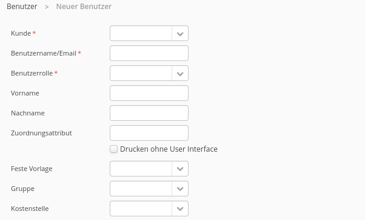

# Benutzer

## Grundlegendes

* Jeder Benutzer ist genau einem Kunden und somit indirekt einem Lettershop zugeordnet
* Für die Administration von Benutzern ist die Rolle [#kunden-administrator](rollen-and-rechte/administrative-rollen.md#kunden-administrator "mention") höher notwendig.

## Attribute

### Allgemein

#### Kunde

Der dem Benutzer zugeordnete Kunde


Diese Auswahl entfällt auf Ebene des Kunden-Administrators


#### Benutzername / Email

Benutzername oder Email des Kunden.\
Dieser Benutzername muss den Aufbau `benutzer@kunde` besitzen um eine Eindeutigkeit zu gewährleisten

#### Benutzerrolle

Die Rolle des Benutzers - siehe [rollen-and-rechte](rollen-and-rechte/ "mention")


Die mögliche Auswahl variiert je nach angemeldetem Verwalter


#### Vorname, Name

Vorname und Name des Benutzers&#x20;

#### Zuordnungsattribut

optionaler Freitext z.B. für Zuordnung von Meta-Daten zu Benutzern - siehe [benutzerzuordnung.md](../themen/benutzerzuordnung.md "mention")

#### Drucken ohne User Interface

Diese Option ermöglicht es einen Druck ohne User-Interface durchzuführen ("headless")

#### Feste Vorlage

Ermöglicht, dass der Benutzer beim Druck keine Auswahl an Vorlagen hat - da er beispielsweise nur eine Art von Dokument drucken darf.

#### Gruppe

Ordnet dem Benutzer optional einer Gruppe zu - siehe [#benutzergruppen](gruppen.md#benutzergruppen "mention")

#### Kostenstelle

Ordnet dem Benutzer optional einer Kostenstelle zu - siehe [kostenstellen.md](../administration/kostenstellen.md "mention")

#### Passwort / Passwort wiederholen

Legt das Passwort  für den Benutzer fest

#### Passwort bei nächster Anmeldung ändern

Der Benutzer wird beim nächsten Login aufgefordert, sein Passwort selbstständig zu ändern

#### Benutzer sperren

Kann verwendet werden, um einen Benutzer zu sperren ohne ihn zu löschen. Sperrt die Anmeldung in Portal / Druck-Client.


Kann zum entsperren von Benutzern verwendet werden, z..B. nach mehrmaliger Falscheingabe von Zugangsdaten.


#### Anmeldung im Portal erlauben

Erlaubt/ Verbietet dem Benutzer das Login über der Website.&#x20;


Wenn inaktiv, kann der Benutzer drucken, jedoch keine Druckaufträge anzeigen  - auch nicht im Drucker-Client.


#### Nur eigene Aufträge zeigen wenn in Gruppe

Wenn aktiviert: Zeigt nur die eigenen Druckaufträge an, wenn inaktiv: Zeigt auch Druckaufträge von Mitgliedern der Benutzergruppe an.

#### Benutzerzuordnung aktiv

Erlaubt eine Benutzerzuordnung über das Zuordnungsattribut (s.o.) - siehe [benutzerzuordnung.md](../themen/benutzerzuordnung.md "mention")

#### OCR erlauben

Erlaubt Texterkennung mit OCR, falls Dokument nicht maschinell lesbar.


Diese Option ist nur für die Rolle Systemanbieter oder höher verfügbar.


#### vollständige Einstellmöglichkeiten anzeigen

Wechselt zwischen einfachen oder erweiterten Druck-Optionen für Druck-Benutzer.&#x20;

#### Vorlagen bearbeiten/einrichten

Gibt dem Benutzer die Möglichkeit, Druckvorlagen zu bearbeiten - unabhängig der zugeordneten Rolle

#### Druckauftrag erstellen im Portal

Der Benutzer kann PDF Aufträge über das Webportal übermitteln.

#### Anhänge bearbeiten/einrichten

Gibt dem Benutzer die Möglichkeit, Anhänge zu bearbeiten - unabhängig der zugeordneten Rolle

#### Onboarding erstellen/einrichten

Gibt dem Benutzer die Möglichkeit, Onboarding Dokumente zu bearbeiten - unabhängig der zugeordneten Rolle - siehe [onboarding.md](../fortgeschrittene-themen/onboarding.md "mention")

#### Status über API setzen

API Endpunkte zum setzen von Statusmeldungen aktivieren / deaktivieren - siehe @API

### Stellvertretung

Regelt die Stellvertretung in Abwesenheit des Benutzers - siehe [stellvertretung.md](stellvertretung.md "mention")

### Einschränkungen beim Druck

Alle Optionen siehe [#einschraenkungen-beim-druck](rollen-and-rechte/druckbenutzer.md#einschraenkungen-beim-druck "mention")
