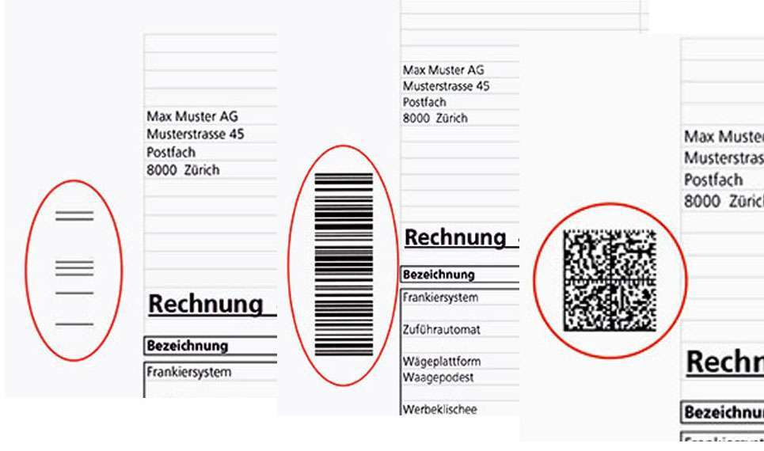

# Kuvertiersteuerung

Die Kuvertiersteuerung beschreibt die Verwendung und Ansteuerung verschiedener Kuvertiermaschinen.

Die Verwendung dieser Steuerung ermöglicht das automatische Kuvertieren von Vorgängen durch voreingedruckte Merkmale.

## Verfügbare Implementierungen

Aktuell Unterstützen wir folgende Kuvertiermaschinen

* Müller ([https://www.mueller-phs.com/](https://www.mueller-phs.com/))
  * Datamatrix
  * OMR
* OMR2Track


Ihre Technik ist nicht aufgeführt? Kommen Sie gerne auf uns zu - eine Implementierung ist mit großer Wahrscheinlichkeit möglich.

