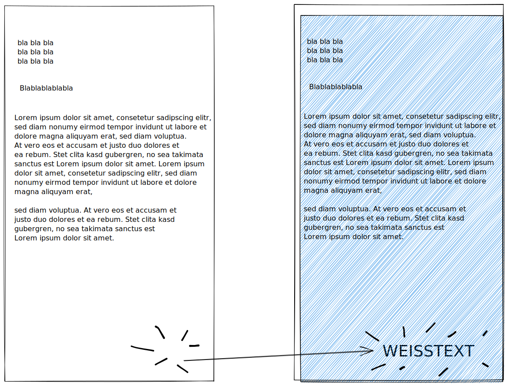

# Weisstext

## Hintergrund

Bestimmte Funktionen des Systems benötigen Merkmale an bestimmten Positionen - wie z.B. eine interne Referenz, Email-Adressen oder sonstige Informationen die für die Druck/Versandsteuerung notwendig sind.

Häufig ist es jedoch so, dass diese Informationen nicht für den Empfänger sichtbar sein sollen - ob aus optischen oder Datenschutzgründen.

## Weisstext in digitalen Dokumenten

Es ist daher eine gängige Praxis, solche Informationen in Weisstext in die digitalen Dokumente (z.B. PDF oder Microsoft Word) einzufügen. Diese sind für digitale Systeme lesbar - werden jedoch beim physikalischen Druck auf Papier **unsichtbar.**

Diese Praxis ermöglicht es, Informationen einzudrucken, welche für digitale Systeme relevant sind und diese dennoch unsichtbar für den Empfänger zu gestalten. \
Druckmaschinen überspringen diese Informationen i.d.R. ebenfalls, wodurch diese Informationen auch nicht über Umwege erkannt werden können

****


**"Weisstext"** bezeichnet hier die gängige Praxis in der davon ausgegangen wird, dass das zu druckende Dokument auf Standard 80g Weiss-Papier gedruckt wird. \
Sollte ein Dokument auf einem farbigen Papier gedruckt werden, so ist der Weisstext in der Farbe des Papiers zu drucken, um später unsichtbar zu sein.



Beim **digitalen** Versand, z.B. über Email werden die PDFs im Original Zustand übermittelt - Blindtextinformationen können so für den Endbenutzer **erkennbar** sein, in dem er diese z.B. in einem PDF Programm textlich markiert. \
Hier wird empfohlen, empfindliche Daten verschlüsselt zu übermitteln - z.B. in Druck-Metadaten


